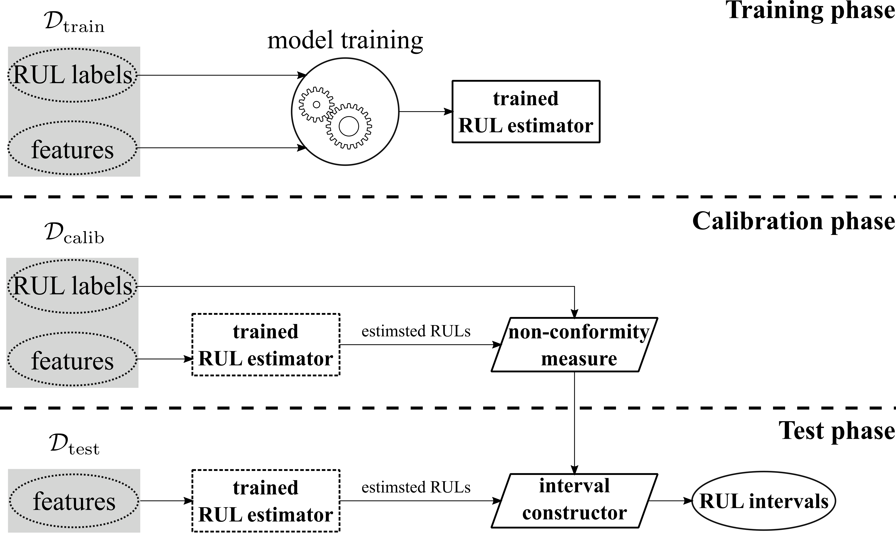

# Conformal Prediction Intervals for Remaining Useful Lifetime Estimation

[](https://arxiv.org/abs/2212.14612)

This repository contains the code for the paper: [Conformal Prediction Intervals for Remaining Useful Lifetime
Estimation](https://doi.org/10.36001%2Fijphm.2023.v14i2.3417),
written by Alireza Javanmardi and Eyke Hüllermeier.
This paper is published in the International Journal of Prognostics and Health Management (IJPHM) 2023.

As the paper's title suggests, we are interested in estimating the remaining useful lifetime (RUL) of a system. However, rather than providing a specific point in time for system failure, such as 

**"The system will fail in $5$ cycles (or days, weeks, etc.)"**,

the output will present a range of potential failure times, such as 

**"The system will fail between $3$ and $6$ cycles (or days, weeks, etc.)"**.

Here is the general procedure of how to construct conformal prediction intervals using any arbitrary single-point RUL estimator:


## Setup
1. Clone the repository
2. Create a new virtual environment and install the requirements:
```shell
 pip install -r requirements.txt
```
3. Activate the virtual environment and run:
  ```shell
 python CNN_experiment.py CMAPSS1 0.1 22
 ```
This line of code will perform an experiment on the CMAPSS dataset FD001 using a deep convolutional neural network as the single-point RUL estimator. 10% of the training data will be put aside for calibration, and the random seed will be set to 22. 

## Citation

If you use this code, please cite our paper:

```
@article{javanmardi2023conformal,
      title = {Conformal Prediction Intervals for Remaining Useful Lifetime Estimation}, 
      author = {Alireza Javanmardi and Eyke Hüllermeier},
      journal = {International Journal of Prognostics and Health Management}
      publisher = {{PHM} Society},
      year = {2023},
      volume = {14},
      number = {2},
      doi = {10.36001/ijphm.2023.v14i2.3417},
      url = {https://doi.org/10.36001%2Fijphm.2023.v14i2.3417}
}

```
